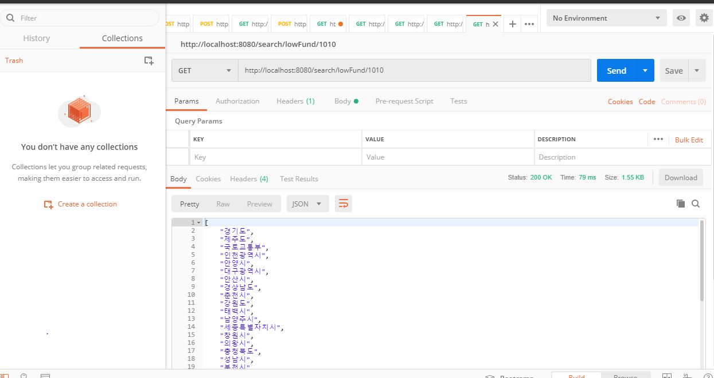

1. 주제 
   - 지자체 협약 지원 API 개발

2. 문제 설계 방법
    1) ENTITIY
        1. BIZ   : 지자체 자원정보  &  LOCAL : 지원 지자체
            1. ONEtoONE MAPPING 사유 : 제공받은 CSV파일 이외에도 [ll][link] [link]: https://www.data.go.kr/dataset/15021140/fileData.do  다른 파일에도 지자체명이 유니크한 값이어서 1:1 매핑을 결정하고, 진행하게 됨.
        1. INPUT : 클라이언트와 매핑되는 정보
            1. 이유 : 데이터베이스와 클라이언트에서 요구하는 각 서비스의 오브젝트의 형태는 다름. 
                       각 서비스 요구사항마다 데이터베이스 기반의 ENTITIY를 활용하기 보다는 클라이언트에서 요구하는 형태에 맞게 새로 구성함.
            2. 컬럼 : 파일에 명시된 요구사항들은 협약데이터에 명시된 규격 기반으로 조작을 원하여, 파일 항목 그대로 작성함.
    2) BATCH
        1. 이유 : 일정한규격의 데이터를 일정한 처리로 일괄로 진행하기 위해 활용        
     
    3) WEB-SERVICE
        1. 각 요구사항마다 모듈을 작성하였으며, TEST 도 이와 같음.
        
3. 문제 해결 방법
    1) 데이터 파일에서 각 레코드를 데이터베이스에 저장
        1. 사용 기술 : BATCH
        2. 사유 : 3-2 에 서술
        
    2) 지자체 전체조회
        1. 사용 기술 : JPA의 공통인터페이스 활용
        2. 사유 : LOCAL과 이미 매핑되어있는 BIZ를 기반으로 FINDALL() 을 사용 후, 클라이언트가 요구하는 INPUT 형태로 출력함
        
    3) 지자체 검색
        1. 사용 기술 : NATIVE SQL 활용
        2. 사유 : 지자체명을 바인딩변수로 BIZ, LOCAL 테이블을 조인한 후에, INPUT 형태로 출력을 하기 위해 JPA 공통인터페이스보다는 NATIVE SQL을 활용하게 됨.
        
    4) 지자체 정보 수정
        1. 사용 기술 : JPA ENTITY의 속성 활요
        2. 사유 : 요구사항에는 특별한 수정컬럼 지정을 하지 않아 사실 SQL로 진행해도 상관없으나, 실 서비스에서는 특정값을 수정하는 서비스들이 많다고 생각하기에 주로 이처럼 사용함.
        
    5) 지원금액으로 내림차순 정렬
        1. 사용 기술 : '지자체 전체조회' 진행 후, 토큰파싱을 활용해 지원금액과 보전율을 구해 리스트 정렬
        2. 사유 
            1. SQL문은 재활용성이 높아야된다 생각하여, SLQ문보다는 JAVA단에 로직을 녹이게 됨. 
            2. 지원금액은 숫자와 화폐단위를 기준으로 분리하고 계산진행함. 단, 추천금액 이내는 해당 정렬기준에서 제외하기 위해 MAX값으로 설정
            3. 이차보전비율의 평균값을 구하기 위하여 이 역시, 숫자와 ~,% 로 문자열을 분리하여 계산 진행함.
            4. 각 계산 로직은 DUMMY 클래스에 존재함.
        
    6) 최저 이차보전 비율의 기관명
        1. 사용 기술 : '지자체 전체조회' 진행 후, 토큰파싱을 활용
        2. 사유 : 
            1. '5)' 에서 이미 이차보전비율의 '평균값'을 구함. '6)' 에서는 이차보전비율의 최저값을 구하기에, 애초에 int[3]{MIN,MAX,MID} 형태로 이차보전비율값을 구하는 모듈을 제작하였으며, 이 중 MIN값을 활용하여 정렬함 
            2. 단, 대출이자 전액일 경우에는 정렬기준에서 제외하기 위해 MAX로 설정
    
4. 개발환경
    1) springBootVersion 1.5.9.RELEASE
    2) INTELLIJ
    3) 사용한 라이브러리
       * JDK 1.8
       * h2
       * hibernate
       * JPA
       * gson
       * gradle

5. 실행 방법
    1) MAIN
        1.  RUN - RUN APPLICATION 진행
        2.  실제 JSON 통신을 확인하기 위해 POSTMAN TOOL 활용
            * https://www.getpostman.com/downloads/
        3.  각 모듈에 위에 정의된 값에 따라 테스트 진행
            * ex 
         ** 실행이 안된다면 settings-build,execution,deployment-annotation processors 에서 enable annotation processing 체크!
    2) TEST
        1. TEST-JAVA-hyemin.forkakaopay-ApplicationTests 에서 각 모듈 옆에 을 클릭하여 RUN 수행
            * log 값 확인
            
 
 6. 참고자료
    * 자바 ORM 표준 JPA 프로그래밍 - 김영한
    * 처음배우는 스프링부트2 - 김영재